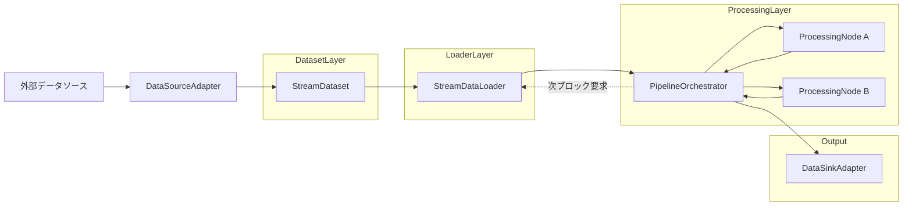
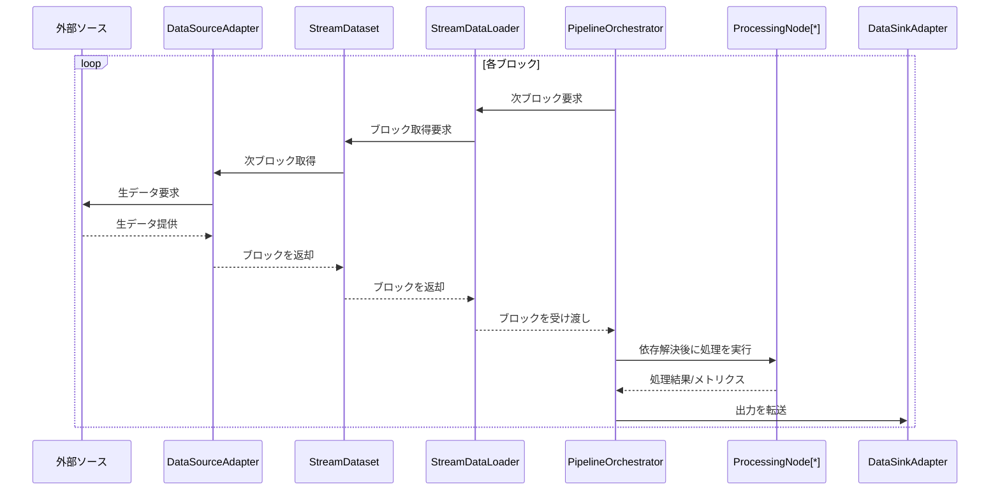

# データフロー図

## 全体フロー
プロジェクトにおけるデータ供給から結果出力までの経路を示します。

- `StreamDataset` がブロック単位でデータを保持・提供し、`StreamDataLoader` が同期的に 1 ブロックずつ供給します。
- `PipelineOrchestrator` は処理ノードの依存を解決し、結果を `DataSinkAdapter` に引き渡します。

## ブロック処理シーケンス
1 ブロックが処理される際のシーケンスを示します。

- 各ブロックの処理完了後に次ブロックが要求されるため、処理時間が直接スループットを決定します。
- 例外発生時は `PipelineOrchestrator` がポリシーに従い停止/継続を制御します。
